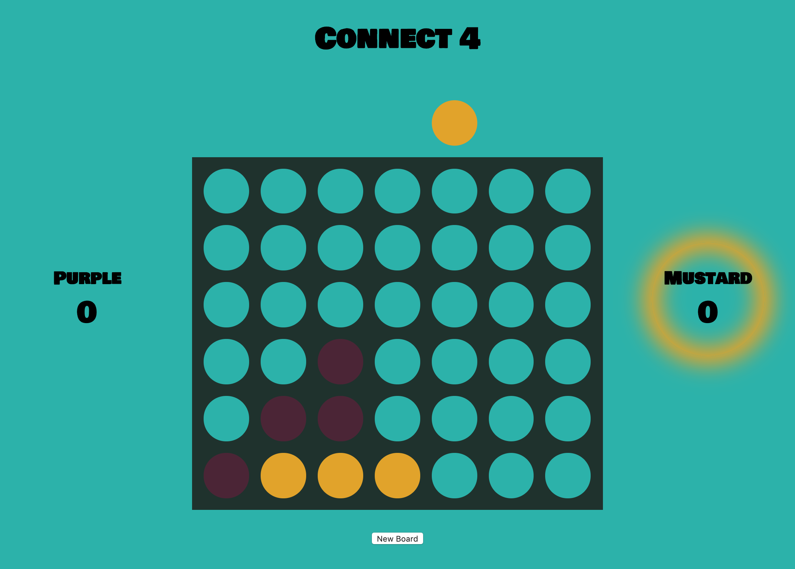
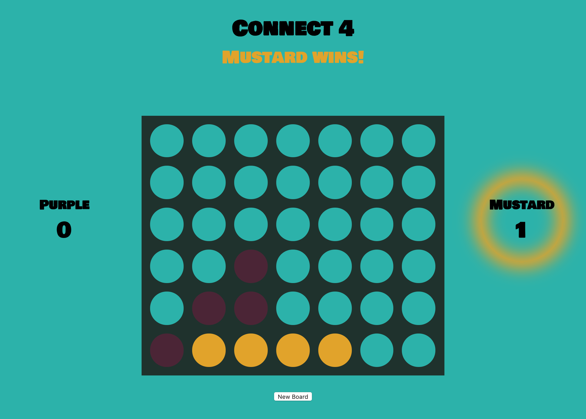
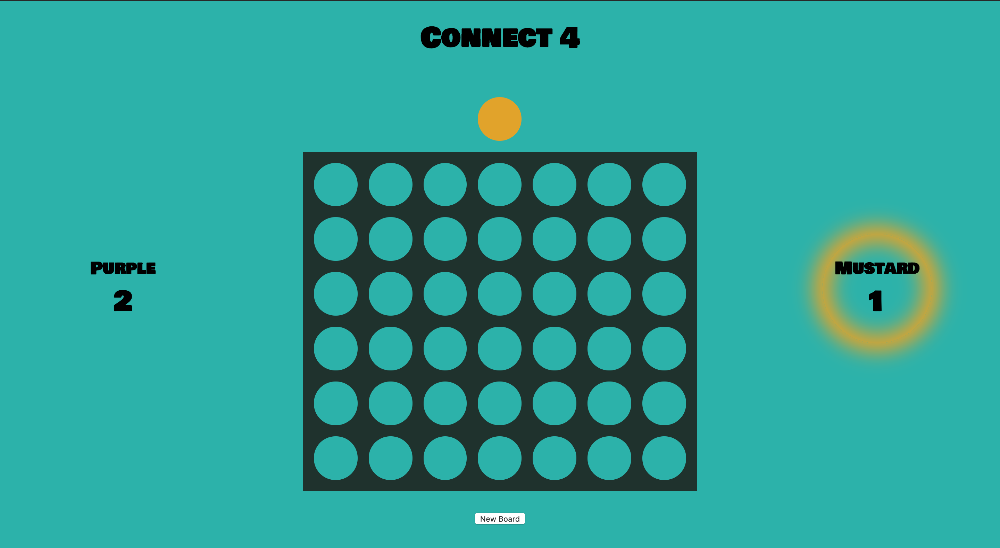

  Connect 4
-

Connect 4 is a two player game. Players take turns dropping their color of disc into columns of a grid. Playing grid is laid out as seven columns, and six rows. 

To win the game, a player must be the first to form a line of four of their own discs. This line can be formed vertically, horizontally, or diagonally.

**Technologies used:**
HTML, CSS, Javascript, Visual Code Studio

**Give it a whirl:**
https://arghmatey.github.io/project1/
- To reset the board, hit that "New Board" button at the bottom of the page.
- Each new game's first turn will be taken by the non-winner of the last round.
- When the board is filled with each players discs with no winner, a tie is declared and a new board will need to be loaded.

**Upcoming enhancements:**
- interactive sound
- player decoration themes
- customizable board grid size

