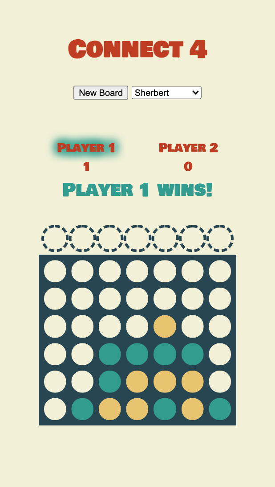

  Connect 4
-

Connect 4 is a two player game. Players take turns dropping their color of disc into columns of a grid. Playing grid is laid out as seven columns, and six rows. 

To win the game, a player must be the first to form a line of four of their own discs. This line can be formed vertically, horizontally, or diagonally.

Technologies used: HTML, CSS, Javascript, Visual Code Studio

Give it a whirl: https://arghmatey.github.io/project1/
- To reset the board, hit that "New Board" button at the bottom of the page.

Upcoming enhancements: sound and themes for a more fun player experience!

